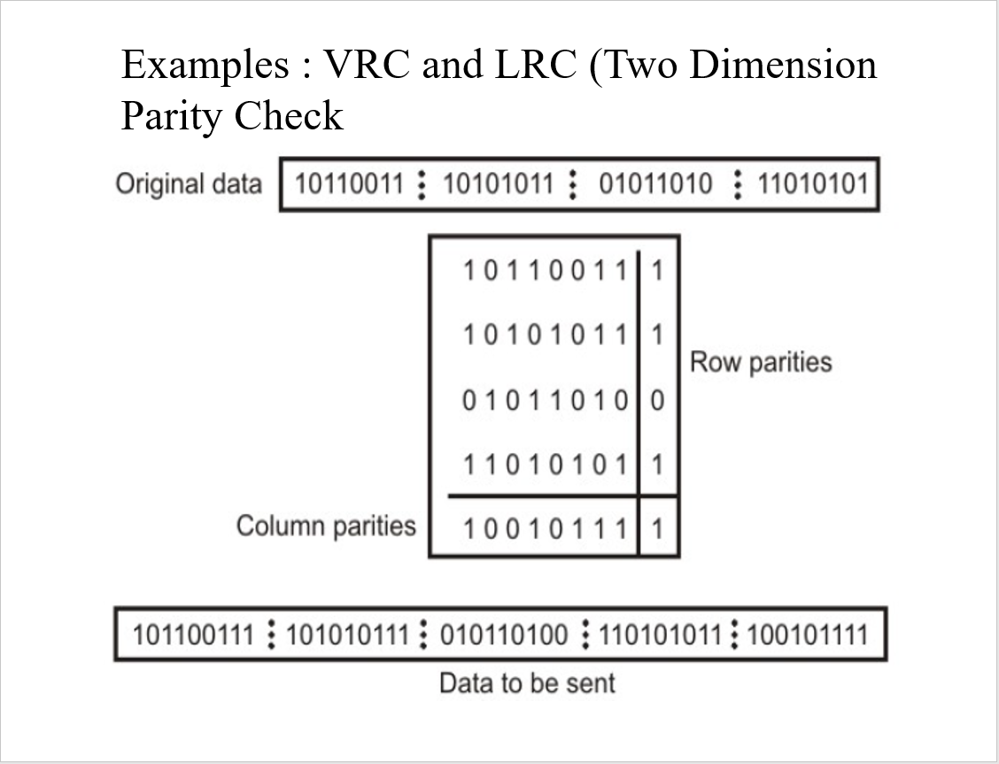

# No 1  
- 1 0 1 1 0 1 0 => ada 4 even bit parity, sehingga 4 % 2 = 0
Jadi data dikirim  
1 0 1 1 0 1 0 0
- 1 1 0 1 1 0 1 => ada 5 even bit parity, sehingga 5 % 2 = 1
Jadi data dikirim  
1 1 0 1 1 0 1 1

# No 2  
Original data   
1101; 1011; 1100; 0110 => ubah ke dalam 2 dimensi matriks  

1101 | 1   
1011 | 1   
1100 | 0   
0110 | 0   
\-------  
1100 | 0

Jadi data dikirim =>
11011; 10111; 11000; 01100; 11000

Ref: https://www.youtube.com/watch?v=IUqmROyaQf4  
Fun vids: https://www.youtube.com/watch?v=MgkhrBSjhag

Example :

# No 3  
Data 1: 10110001101110110101101111010100  
Data 2: 110001101110110101101111010100   
Checksum Error   
Data 1 xor Data 2  
 10110001101110110101101111010100  
   110001101110110101101111010100  

`Unsolvable :v`

# No 4  
- a   
    Original Data : 10110101110  
    Generator : 1011 (4 bit) => n = 4

    - karena generator nya 4 bit maka tambahkan 3 (n-1) bit    0 ke original data  
      10110101110 **000**
    - Xor division (pembagian xor)  
      10110101110000 dibagi 1011  
      didapatkan sisa bagi = 0111  
      ambil 3 (n-1) digit awal nya = **111 => ini adalah crc frame bit nya**
    - Transmitted Data => original data + crc frame bit  
      10110101110111

    - Error Check (saya anggap ini untuk cek error pada        receiver)
        - Membagi transmitted data dengan generator  
          10110101110111 / 1011  
          maka didapatkan sisa bagi = 0001
        - Karena sisa nya bukan 0000 maka **terjadi error**    pada data yang dikirimkan

- b  
    Original Data : 1111111  
    Generator : 1001 (4 bit) => n = 4

    - karena generator nya 4 bit maka tambahkan 3 (n-1) bit    0 ke original data  
      1111111 **000**
    - Xor division (pembagian xor)  
      1111111 dibagi 1001  
      didapatkan sisa bagi = 0001  
      ambil 3 (n-1) digit awal nya = **001 => ini adalah crc frame bit nya**
    - Transmitted Data => original data + crc frame bit  
      1111111001

    - Error Check (saya anggap ini untuk cek error pada        receiver)
        - Membagi transmitted data dengan generator  
          1111111001 / 1001  
          maka didapatkan sisa bagi = 0000
        - Karena sisa nya merupakan 0000 maka **tidak          terjadi error** pada data yang dikirimkan

Ref: https://www.youtube.com/watch?v=ozusDGVPtn8&list=PL6aFkLM6Wp-ogOIuVC9KWFZmraQf6RmnR&index=13

Tutorial di buku stalling chap.6 hal.190

# No 5  
12 bit data dibentuk oleh 8 bit data dan 4 bit parity  
dicari 8 bit data dari 12 bit hamming code tersebut  

Hamming code = 0 1 0 0 0 0 0 0 0 1 0 1  

0 1 0 0 0 0 0 0 0 1 0 1  
1 2 3 4 5 6 7 8 9 10 11 12

maka diambil bit parity yaitu yang merupakan data ke-2^n

**Data 1 (2^0) = 0 => p1data**  
**Data 2 (2^1) = 1 => p2data**  
Data 3 = 0  
**Data 4 (2^2) = 0 => p3data**  
Data 5 = 0  
Data 6 = 0  
Data 7 = 0  
**Data 8 (2^3) = 0 => p4data**  
Data 9 = 0  
Data 10 = 1  
Data 11 = 0  
Data 12 = 1  

Cek terlebih dahulu error nya

p1 (ambil 1 skip 1, dimulai dari p1) = XOR dari data ke **1** ~~2~~ **3** ~~4~~ **5** ~~6~~ **7** ~~8~~ **9** ~~10~~ **11** ~~12~~ = XOR ?000010 = 1  
p2 (ambil 2 skip 2, dimulai dari p2) = XOR dari data ke **2** **3** ~~4 5~~ **6** **7** ~~8 9~~ **10** **11** ~~12~~ = XOR ?00010 = 1  
p3 (ambil 4 skip 4, dimulai dari p3) = XOR dari data ke **4 5 6 7** ~~8 9 10 11~~ **12** = XOR ?0001 = 1  
p4 (ambil 8 skip 8, dimulai dari p4) = XOR dari data ke **8 9 10 11 12** = XOR ?0101 = 0

p1 (1) != p1data (0)   
p2 (1) == p2data (1)  
p3 (1) != p3data (0)  
p4 (0) == p4data (0)  

Jumlahkan semua yang tidak sama (ambil hasil pangkatnya)  
p1 **(2^0)** = 1  
p3 **(2^2)** = 4 
Jumlah = 1 + 4 = 5  
maka flip bit ke 5  
  
Data hamming code awal tanpa bit parity yaitu  
01000101

ref:
- https://www.youtube.com/watch?v=TYwrHiQ2-G4  
- https://www.youtube.com/watch?v=JAMLuxdHH8o

# No 6  
8 bit data = 11000100  
disisipkan dengan 4 bit parity  

**Data 1 (2^0) = ? => p1**  
**Data 2 (2^1) = ? => p2**  
Data 3 = 1  
**Data 4 (2^2) = ? => p3**  
Data 5 = 1  
Data 6 = 0  
Data 7 = 0  
**Data 8 (2^3) = ? => p4**  
Data 9 = 0  
Data 10 = 1  
Data 11 = 0  
Data 12 = 0  

p1 (ambil 1 skip 1, dimulai dari p1) = XOR dari data ke **1** ~~2~~ **3** ~~4~~ **5** ~~6~~ **7** ~~8~~ **9** ~~10~~ **11** ~~12~~ = XOR ?11000 = 0  
p2 (ambil 2 skip 2, dimulai dari p2) = XOR dari data ke **2** **3** ~~4 5~~ **6** **7** ~~8 9~~ **10** **11** ~~12~~ = XOR ?10010 = 0  
p3 (ambil 4 skip 4, dimulai dari p3) = XOR dari data ke **4 5 6 7** ~~8 9 10 11~~ **12** = XOR ?1000 = 1  
p4 (ambil 8 skip 8, dimulai dari p4) = XOR dari data ke **8 9 10 11 12** = XOR ?0100 = 1  

Setelah itu satukan semua datanya

**Data 1 (2^0) = 0**  
**Data 2 (2^1) = 0**  
Data 3 = 1  
**Data 4 (2^2) = 1**  
Data 5 = 1  
Data 6 = 0  
Data 7 = 0  
**Data 8 (2^3) = 1**  
Data 9 = 0  
Data 10 = 1  
Data 11 = 0  
Data 12 = 0  

Transmit data = 001110010100